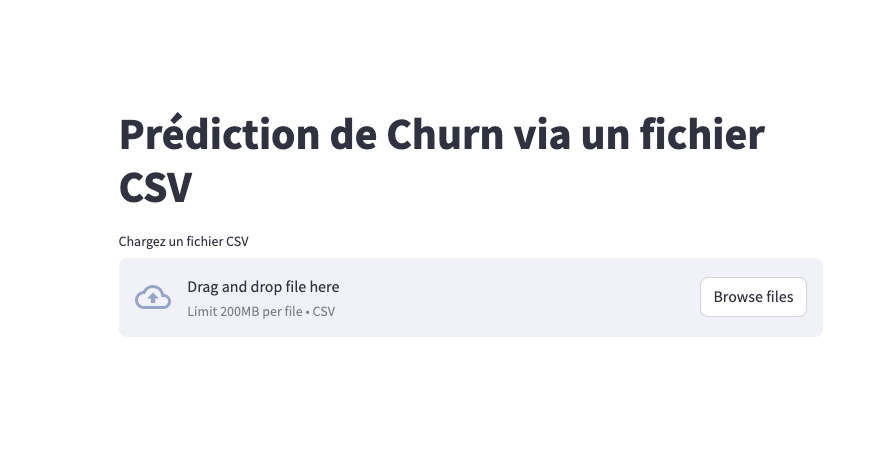

# 🧠 Prédiction du Churn Client - Projet Machine Learning (Streamlit + FastAPI)

Ce projet permet de prédire si un client risque de résilier son abonnement à un service. Il utilise un modèle de régression logistique avec une interface Streamlit pour les utilisateurs et une API FastAPI pour le traitement et les prédictions.

---

## 📦 Fichiers inclus

🚀 Lien de l'API déployée
👉 API Cloud Render :
https://deploiement-de-modele-fast-api-et-docker.onrender.com

⚠️ Important : l’API étant hébergée sur Render (hébergement gratuit), elle peut mettre 30-60 secondes à démarrer à froid.
Attendez qu’elle soit bien active avant d'utiliser l'application Streamlit, sinon vous aurez une erreur.


## 📁 Structure du projet


├── app_streamlit.py      # Application principale Streamlit

├── preprocessing.py      # Fonction de transformation des données

├── logreg_model.joblib   # Modèle entraîné (régression logistique)

├── column_order.joblib   # Ordre attendu des colonnes après preprocessing

├── expected_columns.json # Colonnes encodées attendues

└── README.md             # Ce fichier


---

## 🚀 Lien de l'API déployée

👉 **API Render** :  
🔗 [https://deploiement-de-modele-fast-api-et-docker.onrender.com](https://deploiement-de-modele-fast-api-et-docker.onrender.com)

⚠️ **Important** : l’API étant hébergée gratuitement sur Render, elle peut mettre **30 à 60 secondes** à démarrer à froid.  
Attendez qu’elle soit bien active avant d'utiliser l'application Streamlit, sinon vous risquez d’obtenir une erreur.

---

## 🎯 Objectif de l'application

Cette application permet :

- ✅ D’uploader un fichier **CSV** contenant des informations client.  
- ✅ De prédire pour chaque client s’il risque de **churn** ou non.  
- ✅ De visualiser les résultats directement dans l’interface utilisateur.  

---

## 🛠️ Comment utiliser l'application

### 1. Activer l’API

Rendez-vous sur ce lien pour **réveiller l’API** (important pour Render) :  
➡️ [https://deploiement-de-modele-fast-api-et-docker.onrender.com](https://deploiement-de-modele-fast-api-et-docker.onrender.com)

---

### 2. Lancer l'app Streamlit en local

Dans un terminal :

```bash
pip install -r requirements.txt
streamlit run app_streamlit.py
```

---

## 3. Préparer votre fichier CSV

Votre fichier CSV doit contenir les colonnes suivantes (en séparateur point-virgule `;` et virgule `,` comme séparateur décimal) :


gender;SeniorCitizen;Partner;Dependents;tenure;PhoneService;MultipleLines;InternetService;OnlineSecurity;OnlineBackup;DeviceProtection;TechSupport;StreamingTV;StreamingMovies;Contract;PaperlessBilling;PaymentMethod;MonthlyCharges;TotalCharges


**Exemple :**

Female;0;Yes;No;12;Yes;No;DSL;Yes;No;No;Yes;No;No;Month-to-month;Yes;Electronic check;29,85;29,85

Vous pouvez aussi télécharger le fichier **test_api3.csv**, accessible depuis le dossier principal, pour tester l'application.


> 📌 **Attention : le format attendu est très strict.**
>
> - Utilisez `;` comme séparateur de colonnes
> - Utilisez `,` comme séparateur de décimales
> - **Toutes les colonnes doivent être présentes**


---

## 📡 Fonctionnement technique

- **Frontend** : Streamlit lit le fichier CSV, transforme chaque ligne en dictionnaire JSON, et envoie une requête POST pour chaque client à l’API.
- **Backend** : FastAPI reçoit les données, les prétraite via `preprocessing.py`, puis applique le modèle de machine learning pour renvoyer une prédiction (**Churn** ou **No Churn**).
- **Retour** : Les résultats sont affichés dans le tableau final.

---

## 📷 Capture d'écran (exemple)




---

## 💡 Idées d'amélioration

- Ajout de graphiques d'analyse post-prédiction
- Détection automatique du format de CSV (virgule ou point-virgule)
- Authentification utilisateur


---

##  Auteur

**Abbas MZE HAMADI**  
Étudiant en Master 2 - Analyse de données & Ingénierie Économique  
📧 contact : abbas.mzehamadi@gmail.com  
🌐 [LinkedIn](#)


